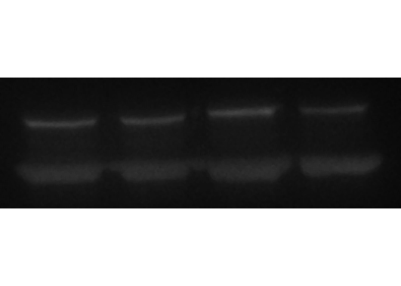
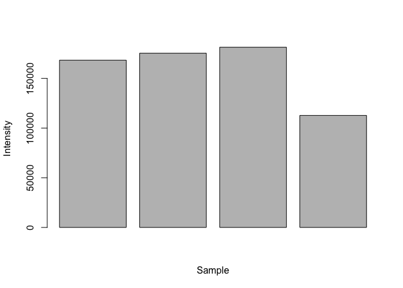

Western Blot
================
Hanne Grosemans

\#Load packages

``` r
library(jpeg)
library("colorspace")
library(caret)
```

    ## Loading required package: lattice

    ## Loading required package: ggplot2

``` r
library(ggplot2)
library("EBImage")
library(dplyr)
```

    ## 
    ## Attaching package: 'dplyr'

    ## The following object is masked from 'package:EBImage':
    ## 
    ##     combine

    ## The following objects are masked from 'package:stats':
    ## 
    ##     filter, lag

    ## The following objects are masked from 'package:base':
    ## 
    ##     intersect, setdiff, setequal, union

``` r
library(magick)
```

    ## Linking to ImageMagick 6.9.9.39
    ## Enabled features: cairo, fontconfig, freetype, lcms, pango, rsvg, webp
    ## Disabled features: fftw, ghostscript, x11

\#Open file and filter \#Crop images, remove ladder and a bit of white
space

``` r
Image <- readImage("trial.jpg")
dim(Image)
```

    ## [1] 407 133

``` r
Image <- 1 - Image^0.7
ImageFiltered <- medianFilter(Image, 1.1)
display(ImageFiltered)
```

<!-- -->

\#Read bands

``` r
#the nim = c(,) is the amount of pieces your image will be cut
Tiles <- untile(ImageFiltered, nim = c(4, 2))
df <- tibble()
for (i in 1:8){
  x <- as.matrix(Tiles[,,i])
  y <- sum((x * 255) - mean(x[1:10,]))
  df <- rbind(df, y)
}
```

\#Calculate

``` r
Gene <- df[1:4,1]
CTR <- df[5:8,1]
CTR_B <- CTR[1]
for (i in 1:4){
  CTR[i] <- CTR[i] / CTR_B
}
Blot <- CTR * Gene
```

\#Graph

``` r
barplot(Blot, xlab = "Sample", ylab = "Intensity")
```

<!-- -->
